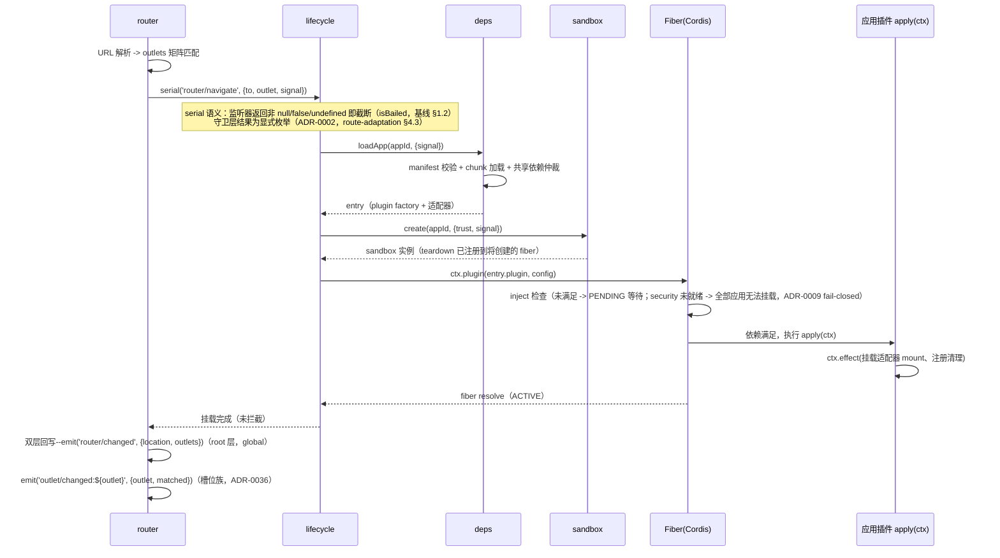
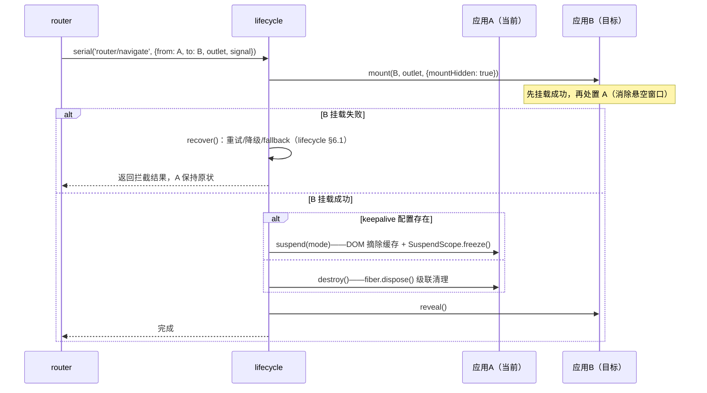
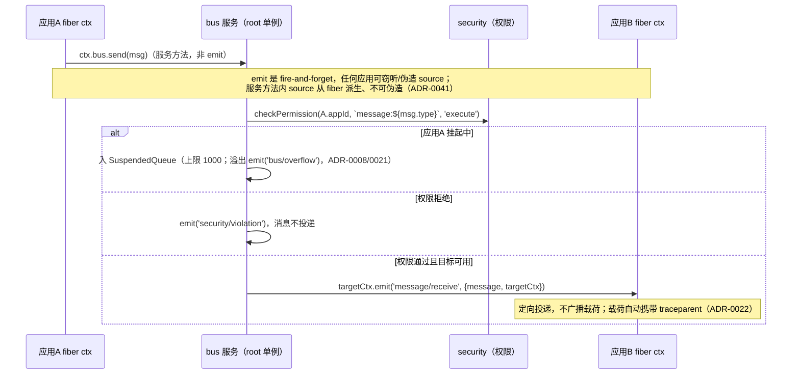
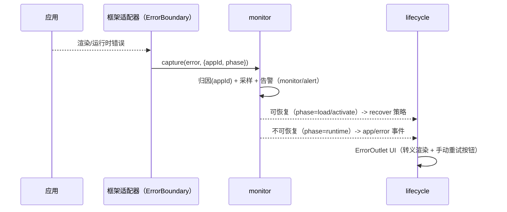
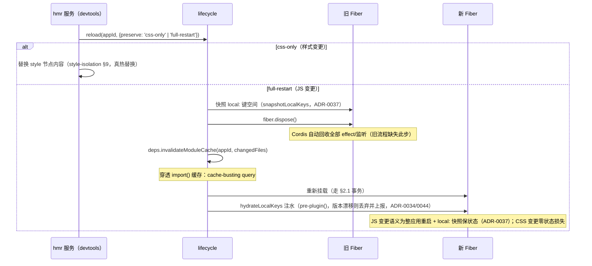

# Cordis 核心模块交互协议（Module Interaction Protocol）

> 对齐基线：[cordis-alignment.md](./cordis-alignment.md)。本协议是各模块文档交互时序/事件契约的**唯一权威**。
> 本协议无独立决策点（ADR-0060）--依赖方向与事件契约已在基线 §2.3/§2.4/§2.4.1 固化，本文是其在时序图上的展开。
> 旧版（qiankun 式 bootstrap/mount/unmount 时序、camelCase 事件、三参 `lifecycleManager.on`）全部作废。

## 一、模块依赖关系图（对齐基线 §2.3，ADR-0054 依赖方向重画）

```mermaid
graph TD
    subgraph 基础层（零业务依赖，最先可用）
        Monitor[monitor 监控]
        Security[security 安全]
    end
    subgraph 服务层（各 inject security，≤2 项）
        Bus[bus 通信]
        State[state 状态]
        Deps[deps 依赖仲裁/加载]
        Sandbox[sandbox 沙箱]
        Router[router 路由]
    end
    subgraph 编排层（唯一多注入者）
        Lifecycle[lifecycle 生命周期]
    end

    Bus --> Security
    State --> Security
    Deps --> Security
    Sandbox --> Security
    Router --> Security
    Lifecycle --> Monitor
    Lifecycle --> Security
    Lifecycle --> Router
    Lifecycle --> Bus
    Lifecycle --> State
    Lifecycle --> Deps
    Lifecycle --> Sandbox
    Router -.->|事件解耦：router/navigate| Lifecycle
```

规则（基线 §2.3）：

1. **monitor/security 不 inject 任何业务服务**--错误采集与权限裁决最先可用（旧图 `Security --> Monitor` 已删除：裁决不依赖采集，ADR-0054）
2. **router 不 inject lifecycle**（旧设计 `Lifecycle inject router` + `Router 依赖 Lifecycle` 构成死锁环）--router 发 `router/navigate` serial 事件，lifecycle 监听执行挂载，结果双层回写：`router/changed`（root 层全矩阵）+ `outlet/changed:{outlet}`（槽位族，ADR-0036）
3. **state 感知挂起靠监听** `app/suspend`/`app/resume` 事件，不 inject lifecycle（ADR-0023--恢复同步走拉模型）
4. **lifecycle 是唯一多注入编排者**（security/router/sandbox/bus/state/deps/monitor）；其余服务 inject ≤2，防止第二个编排者出现（ADR-0054）
5. **lifecycle 显式 inject security**：安全服务未就绪则全部应用无法挂载--fail-closed（ADR-0009）
6. **应用实例（Fiber）不再是图中的"模块"**--应用 = 插件，消费上述服务；旧图 `Lifecycle -->|依赖| App` 自引用已删除
7. 初始化顺序 = Cordis DI 按 `static inject` 自动解析，**禁止手写分层顺序表**（旧 §4 的四层手工排序废除；Cordis Fiber PENDING 机制天然处理"服务未就绪"）

## 二、关键流程时序

### 2.1 首次加载（对齐 lifecycle-management.md §2.2）



要点：

- **沙箱创建在资源加载之后**（旧 lifecycle 文档"created 态即建沙箱"与旧模块交互文档"Loader 返回后建"矛盾，统一为后者）
- **scopedFetch 注入时机**：lifecycle 在沙箱创建后、`ctx.plugin()` 前把 `scopedFetch` 注入沙箱全局（ADR-0005）--应用代码首次执行时 fetch 拦截已就位
- apply 的执行由 Cordis Fiber 控制，lifecycle 只 `await fiber`
- 每个应用的挂载事务支持 AbortSignal 全链路透传（`router/navigate` 载荷自带）

### 2.2 应用切换（保活与销毁统一走 lifecycle §3.3 事务）



### 2.3 跨应用消息（对齐 communication-protocol.md §3.1--发送走服务方法，ADR-0041）



请求-应答（`bus.request()`）与能力调用走 `serial` + 统一包络 `{ok,value,reason}`（`bail` 全局禁用，ADR-0014/0016）；单点查询（如 scopedFetch 权限裁决）不走事件调度，直接 `await ctx.security.check()`（ADR-0028）--结果契约按事件族划分见基线 §2.4.1。

### 2.4 错误降级（修复旧流程"重试早于卸载"的顺序问题）



- **重试计数**存于 lifecycle recover 状态（旧流程"计数谁存/何时清零"缺失已补：attempt 随挂载事务传递，成功后自然清零）
- 渲染错误现场**先保留再降级**（旧流程"先重试后卸载"的顺序错误已修正：错误捕获 -> 上报 -> 按策略处置）

### 2.5 热更新（修复"不 dispose fork 导致监听残留"）



## 三、统一事件契约（引用基线 §2.4 唯一版本）

事件契约以 [cordis-alignment.md §2.4](./cordis-alignment.md) 为唯一版本（ADR-0059），此处仅列时序图中实际出现的子集与各文档详细展开的索引：

| 事件 | 载荷要点 | 详细展开 |
|------|----------|----------|
| `app/loading` → `app/loaded` → `app/ready` | fiber 状态机派生（PENDING/LOADING/ACTIVE）；signal 仅作通知 | lifecycle-management.md §二 |
| `app/suspend` / `app/resume` | reason: keepalive/navigation/system；**纯通知，非意图**（挂起意图走 `lifecycle.requestSuspend()` 服务方法，ADR-0035） | lifecycle-management.md §5.1 |
| `app/evicted` | LRU/水位驱逐，已 dispose（ADR-0019） | lifecycle-management.md §5.4 |
| `app/error` / `app/disposed` | phase: load/activate/runtime；recoverable | lifecycle-management.md §六 |
| `router/navigate` | serial，可拦截；守卫层结果为显式枚举（ADR-0002） | route-adaptation.md §四 |
| `router/changed` | 全槽位矩阵，**仅 root 层** DevTools/monitor 可见（global:true，ADR-0036） | route-adaptation.md §4.5 |
| `outlet/changed:{outlet}` | 槽位独立通知族（模板字面量类型，ADR-0050）；隔离视图只订阅本槽位；挂起恢复重放（ADR-0056） | route-adaptation.md §3.3 |
| `message/send` / `message/receive` | 发送经 `ctx.bus.send` 服务方法（ADR-0041）；定向投递；载荷自动携带 traceparent（ADR-0022） | communication-protocol.md §3.1 |
| `bus/overflow` | {coalescedKeys, droppedCount}（ADR-0021） | communication-protocol.md §5.5 |
| `state/changed` | 单对象 + version + source | state-sharing.md §4.3 |
| `state/sync` | 挂起恢复一次性同步（拉模型，ADR-0023） | state-sharing.md §4.3 |
| `monitor/report` / `monitor/alert` | 单对象统一形状；旁听需 global:true | monitoring.md |
| `security/violation` | appId + rule + detail | security.md |

**调度结果契约按事件族划分**（基线 §2.4.1，ADR-0012）：守卫族 serial + 显式枚举 / 请求-应答族 serial + 统一包络（bail 禁用）/ 单点查询直接服务方法（无包络）/ 通知族 emit 无返回值。族边界以事件名前缀划分，可写 lint 规则机器校验。

**已删除事件**：`app/intent:suspend` / `app/intent:resume`（挂起意图改走服务方法，ADR-0035）；`sandbox:created/destroyed/*`（内部实现细节，不构成公共契约）。

对照旧契约的变更：

| 旧契约 | 新契约 | 变更原因 |
|--------|--------|----------|
| `lifecycle:beforeLoad/loaded/beforeMount/mounted/beforeUnmount/unmounted`（camelCase，mount 语义） | `app/loading/loaded/ready/error/suspend/resume/disposed/evicted`（kebab-case，fiber 语义） | 对齐 Cordis Fiber 状态机；废除双生命周期协议 |
| `lifecycle:beforeLoad` 载荷 `(appId, signal?)`（AbortSignal 广播可被任何插件 abort） | `app/loading` 载荷单对象且 signal 仅作通知 | signal 控制权在 lifecycle，旁听者不可 abort |
| `sandbox:created/destroyed/activated/deactivated` | 删除（内部实现细节，不构成公共契约） | 沙箱生命周期由 lifecycle §四所有权表管理 |
| `state:change(appId, key, value, oldValue, path?)`（5 参） | `state/changed`（单对象 + version + source） | 与 state-sharing.md 版本系统唯一对齐 |
| `monitor:report(metric, traceId?)`（2 参） | `monitor/report({metric})` | traceId 进 metric 内部（monitoring §4.6） |
| `comm:message` | `bus.send` 服务方法 + `message/receive` 定向投递 | emit 冒泡可被窃听/伪造 source（ADR-0041） |
| `router/changed` 全应用可见 | root 层 only（global）+ 槽位族 `outlet/changed:{outlet}` | 隔离视图只读本槽位（ADR-0006/0036/0047） |
| `app/intent:suspend/resume`（草稿） | 删除，意图走 `lifecycle.requestSuspend/Resume` | 鉴权走服务方法、通知走事件（ADR-0035） |

## 四、模块职责与初始化（Cordis DI 自动化，对齐基线 §2.2/§2.3）

| 服务 | provide | inject | 就绪标志 |
|------|---------|--------|----------|
| monitor | `monitor` | （无，唯一零依赖） | 构造完成即可 capture |
| security | `security` | （无业务依赖） | 权限/白名单装载 |
| bus | `bus` | `['security', 'monitor']` | 可投递消息 |
| state | `state` | `['security', 'monitor']` | 三层状态可读写 |
| deps | `deps` | `['security', 'monitor']` | 可加载应用 |
| sandbox | `sandbox` | `['security', 'monitor']` | 可创建沙箱 |
| router | `router` | `['security', 'monitor']` | URL 同步启动（挂载经事件解耦，不 inject lifecycle） |
| lifecycle | `lifecycle` | `['security', 'router', 'sandbox', 'bus', 'state', 'deps', 'monitor']`（唯一多注入者，ADR-0054） | 可挂载事务 |

> inject 上限：除 lifecycle（7 项）外一律 ≤2（ADR-0054）；security/monitor 的 inject 为空——它们是最先可用的基础层（security 违规经 `security/violation` 事件上报、由 monitor 旁听，不建立 inject 依赖）。

- **核心层不可替换**（ADR-0011）：八个服务运行时替换 = 框架级重启事件，必须经框架入口而非散落的 `ctx.set`
- **宿主入口**：`ctx.plugin([monitor, security, bus, state, deps, sandbox, lifecycle, router])`--顺序仅表达意图，实际激活由 Cordis 依赖解析决定
- **fail-closed**（ADR-0009）：lifecycle 显式 inject security；安全服务未就绪则全部应用停留 PENDING、无法挂载
- 应用插件 `inject: ['router', 'state', 'bus']` 未就绪时停留 PENDING，**不存在"应用先到、服务未建"的竞态**（旧文档"手动初始化顺序"全部场景由此消除）

## 五、Context 语义澄清（修复旧 §6 两处理论错误）

1. **子应用上下文来自 `ctx.plugin()`**（Fiber 构造时 `parent.extend({ fiber })` 派生），**不是** `ctx.isolate()`。
2. `ctx.isolate(name)` 用于**服务隔离**：如宿主为某个应用声明 `ctx.isolate('router-view')` 后，其子树内 router 视图服务解析到独立实例（多槽位场景，见 route-adaptation.md §五）。
3. **监听器清理语义**：`ctx.on` 注册的监听在 **dispose** 时自动清理（Cordis 将其挂在 fiber.effect 上）；**保活（Suspended）不清理**任何监听/效应--监听保留但 bus 为挂起应用排队消息（§5.6 与"冻结态直接处理消息"互斥，见 lifecycle-management.md §5.2/§5.6）。旧文档"失活即清理"表述已废除。
4. **事件可见性**：事件派发经 `Context.filter`（基于 isolate 标签）过滤；跨域旁听必须 `{ global: true }`。isolate 仅白名单两处：router 按槽位、monitor 按应用（ADR-0010）。

```typescript
// 示例：monitor 旁听全部生命周期事件（唯一正确姿势）
export default class MonitorService extends Service {
  static [Context.provide] = 'monitor'
  constructor(ctx: Context) {
    super(ctx)
    for (const name of ['app/loading', 'app/ready', 'app/error', 'app/disposed']) {
      ctx.on(name, (e) => this.recordLifecycle(name, e), { global: true })
    }
  }
}
```

## 六、模块间数据流约定

| 数据 | 生产者 | 消费者 | 载体 |
|------|--------|--------|------|
| 应用状态 | fiber.state | monitor / devtools | `lifecycle.getAppState(instanceId)`（唯一同步 API） |
| 指标 | monitor 采集器 | 告警引擎 / devtools | `monitor/report` 事件 + BatchReporter（聚合汇于 root sink，ADR-0045） |
| 错误 | 任意模块 | monitor | `monitor.capture(error, {appId, phase})`（唯一入口） |
| 导航意图 | router | lifecycle | `router/navigate` serial 事件（事件解耦，无 inject 环） |
| 消息 | 应用 | bus -> 目标应用 | `ctx.bus.send` 服务方法 -> `message/receive` 定向投递（ADR-0041） |
| 挂起意图 | 应用/宿主 | lifecycle | `lifecycle.requestSuspend/Resume` 服务方法（非事件，ADR-0035） |
| 状态变更 | state 写入管线 | 订阅者 / 跨 tab | `state/changed` 事件 + BroadcastChannel |
| 挂起期间状态 | state 服务 | 恢复的应用 | `state/sync` 一次性同步（拉模型，ADR-0023） |
| 驱逐/HMR 快照 | lifecycle | 重新挂载的应用 | `snapshotLocalKeys`/`hydrateLocalKeys`（ADR-0029/0037） |

## 七、与旧文档差异一览

| 旧设计问题（评审编号） | 本版修复 |
|------------------------|----------|
| M1-1 `ctx.isolate()` 误解为"生成子应用上下文" | §五 澄清：plugin() 派生、isolate 服务隔离 |
| M1-2 qiankun 式 bootstrap/mount/unmount 双轨 | 全部时序改 fiber 语义（§二） |
| M1-3 "失活自动清理监听"与保活矛盾 | §五-3：dispose 清理、Suspended 保留监听但消息排队 |
| M1-4 AbortSignal 作为广播载荷 | signal 只随事务传递、旁听者只读（§三注） |
| M2-1 实例与模块混层的依赖图 | §一 重画：纯服务依赖 + router 事件解耦 |
| M2-2 切换无回滚/保活分支 | §2.2 先挂后卸 + 保活分支 |
| M2-4 HMR 不 dispose fork | §2.5 快照 + fiber.dispose() + 模块缓存穿透 + 注水（ADR-0037） |
| M2-6 事件契约代码块语法损坏/契约悬空 | §三 完整契约 + 与时序一一对应 |
| M2-8 手动初始化顺序否定 DI | §四 Cordis DI 自动解析 |
| X-1/2/5/6 事件与生命周期范式跨文档不一致 | 基线 §2.4 为唯一版本，本文 §三 为时序索引（ADR-0059） |
| X-3 Router↔Lifecycle 死锁环 | §一 规则 2：事件解耦 |
| X-8 双错误体系 | §2.4 唯一入口 monitor.capture |
| （ADR 修订）emit 发送消息可被窃听/伪造 | §2.3 改 `ctx.bus.send` 服务方法（ADR-0041） |
| （ADR 修订）单一 `router/changed` 全可见 | 双层回写：root 层 `router/changed` + 槽位族 `outlet/changed:{outlet}`（ADR-0036/0047） |
| （ADR 修订）security inject monitor 的隐藏耦合 | 两者皆零业务依赖（ADR-0054 依赖方向重画） |
