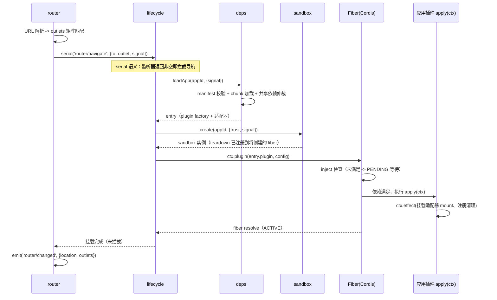
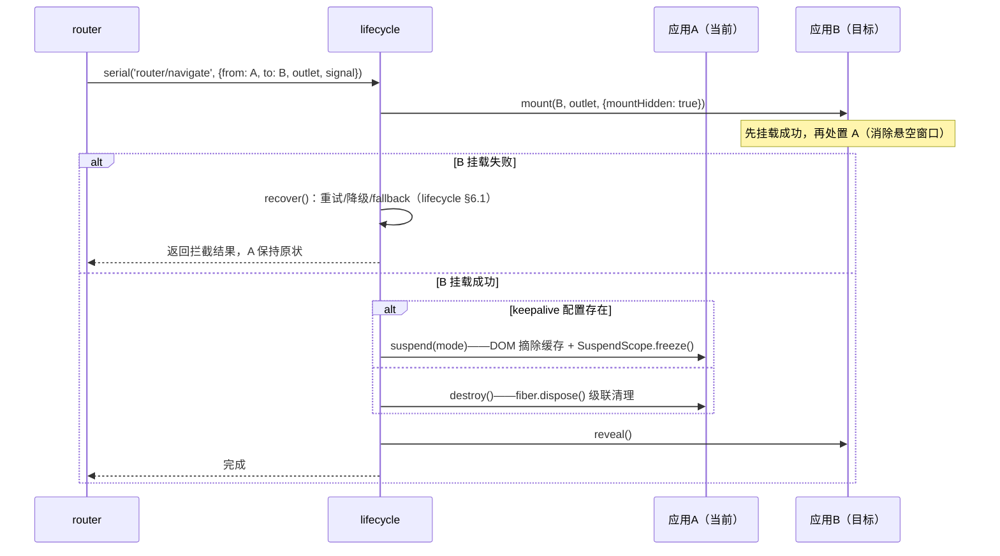
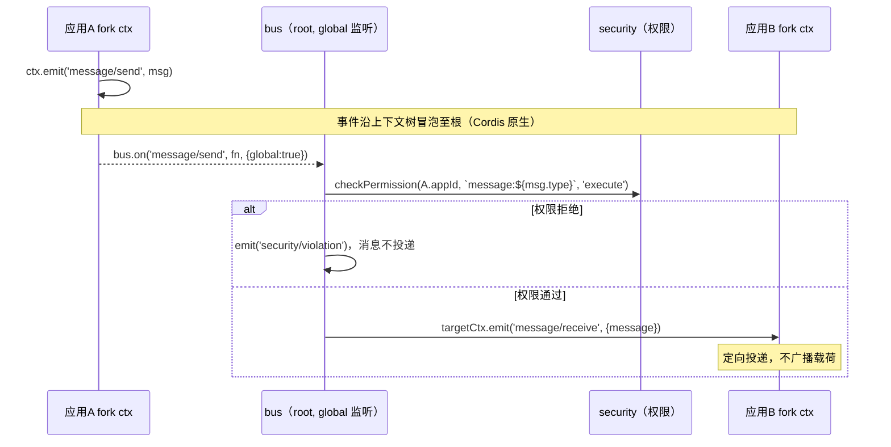
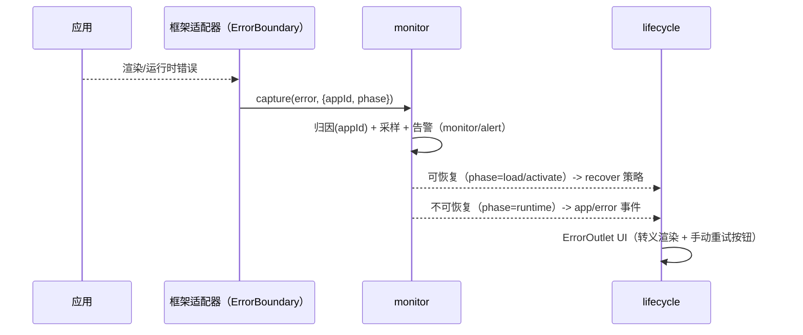
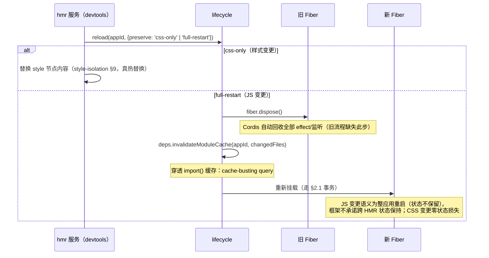

# Cordis 核心模块交互协议（Module Interaction Protocol）

> 对齐基线：[cordis-alignment.md](./cordis-alignment.md)。本协议是各模块文档交互时序/事件契约的**唯一权威**。
> 旧版（qiankun 式 bootstrap/mount/unmount 时序、camelCase 事件、三参 `lifecycleManager.on`）全部作废。

## 一、模块依赖关系图（修复依赖环与实例/模块混层）

```mermaid
graph TD
    subgraph 基础层（无业务依赖，最先可用）
        Monitor[monitor 监控]
        Security[security 安全]
    end
    subgraph 服务层
        Bus[bus 通信]
        State[state 状态]
        Deps[deps 依赖仲裁/加载]
        Sandbox[sandbox 沙箱]
    end
    subgraph 编排层
        Lifecycle[lifecycle 生命周期]
        Router[router 路由]
    end

    Security --> Monitor
    Bus --> Security
    State --> Security
    Deps --> Security
    Sandbox --> Security
    Bus --> Monitor
    State --> Monitor
    Deps --> Monitor
    Sandbox --> Monitor
    Lifecycle --> Monitor
    Lifecycle --> Deps
    Lifecycle --> Sandbox
    Router --> Monitor
    Router -.->|事件解耦：router/navigate| Lifecycle
```

规则（基线 §2.3）：

1. **monitor/security 不依赖任何业务服务**--错误采集最先可用
2. **router 不 inject lifecycle**（旧设计 `Lifecycle inject router` + `Router 依赖 Lifecycle` 构成死锁环）--router 发 `router/navigate` serial 事件，lifecycle 监听执行挂载，结果经 `router/changed` 回写
3. **应用实例（Fiber）不再是图中的"模块"**--应用 = 插件，消费上述服务；旧图 `Lifecycle -->|依赖| App` 自引用已删除
4. 初始化顺序 = Cordis DI 按 `static inject` 自动解析，**禁止手写分层顺序表**（旧 §4 的四层手工排序废除；Cordis Fiber PENDING 机制天然处理"服务未就绪"）

## 二、关键流程时序

### 2.1 首次加载（对齐 lifecycle-management.md §2.2）



要点：

- **沙箱创建在资源加载之后**（旧 lifecycle 文档"created 态即建沙箱"与旧模块交互文档"Loader 返回后建"矛盾，统一为后者）
- apply 的执行由 Cordis Fiber 控制，lifecycle 只 `await fiber`
- 每个应用的挂载事务支持 AbortSignal 全链路透传（`router/navigate` 载荷自带）

### 2.2 应用切换（保活与销毁统一走 lifecycle §3.3 事务）



### 2.3 跨应用消息（对齐 communication-protocol.md §三）



### 2.4 错误降级（修复旧流程"重试早于卸载"的顺序问题）



- **重试计数**存于 lifecycle recover 状态（旧流程"计数谁存/何时清零"缺失已补：attempt 随挂载事务传递，成功后自然清零）
- 渲染错误现场**先保留再降级**（旧流程"先重试后卸载"的顺序错误已修正：错误捕获 -> 上报 -> 按策略处置）

### 2.5 热更新（修复"不 dispose fork 导致监听残留"）



## 三、统一事件契约（唯一版本，基线 §2.4）

```typescript
interface Events {
  // 生命周期（应用 ctx 上派发；旁听用 global:true）
  'app/loading': (e: { appId: string; instanceId: string; signal: AbortSignal }) => void
  'app/loaded': (e: { appId: string; instanceId: string }) => void
  'app/ready': (e: { appId: string; instanceId: string }) => void
  'app/error': (e: { appId: string; instanceId: string; phase: 'load' | 'activate' | 'runtime'; error: Error; recoverable: boolean }) => void
  'app/suspend': (e: { instanceId: string; reason: 'keepalive' | 'navigation' }) => void
  'app/resume': (e: { instanceId: string }) => void
  'app/disposed': (e: { appId: string; instanceId: string }) => void
  // 路由
  'router/navigate': (e: { from: RouteLocation; to: RouteLocation; outlet: string; signal: AbortSignal }) => void | boolean   // serial，可拦截
  'router/aborted': (e: { outlet: string; reason: 'guard' | 'superseded' | 'unmount' }) => void
  'router/changed': (e: { location: RouteLocation; outlets: Record<string, MatchedApp | null> }) => void
  // 通信
  'message/send': (e: { message: CordisMessage }) => void
  'message/receive': (e: { message: CordisMessage }) => void
  // 状态
  'state/changed': (e: { key: string; value: unknown; old: unknown; path: string; source: string; version: number }) => void
  // 监控（旁听需 global:true）
  'monitor/report': (e: { metric: Metric }) => void          // 单对象统一形状
  'monitor/alert': (e: { alert: Alert }) => void
  // 安全
  'security/violation': (e: { appId: string; rule: string; detail: unknown }) => void
}
```

对照旧契约的变更：

| 旧契约 | 新契约 | 变更原因 |
|--------|--------|----------|
| `lifecycle:beforeLoad/loaded/beforeMount/mounted/beforeUnmount/unmounted`（camelCase，mount 语义） | `app/loading/loaded/ready/error/suspend/resume/disposed`（kebab-case，fiber 语义） | 对齐 Cordis Fiber 状态机；废除双生命周期协议 |
| `lifecycle:beforeLoad` 载荷 `(appId, signal?)`（AbortSignal 广播可被任何插件 abort） | `app/loading` 载荷单对象且 signal 仅作通知 | signal 控制权在 lifecycle，旁听者不可 abort |
| `sandbox:created/destroyed/activated/deactivated` | 删除（内部实现细节，不构成公共契约） | 沙箱生命周期由 lifecycle §四所有权表管理 |
| `state:change(appId, key, value, oldValue, path?)`（5 参） | `state/changed`（单对象 + version + source） | 与 state-sharing.md 版本系统唯一对齐 |
| `monitor:report(metric, traceId?)`（2 参） | `monitor/report({metric})` | traceId 进 metric 内部（monitoring §4.6） |
| `comm:message` | `message/send` + `message/receive` | 定向投递模型（bus 在两处分别派发） |

## 四、模块职责与初始化（Cordis DI 自动化）

| 服务 | provide | inject | 就绪标志 |
|------|---------|--------|----------|
| monitor | `monitor` | （无） | 构造完成即可 capture |
| security | `security` | `['monitor']` | 权限/白名单装载 |
| bus | `bus` | `['security', 'monitor']` | 可投递消息 |
| state | `state` | `['security', 'monitor']` | 三层状态可读写 |
| deps | `deps` | `['security', 'monitor']` | 可加载应用 |
| sandbox | `sandbox` | `['security', 'monitor']` | 可创建沙箱 |
| lifecycle | `lifecycle` | `['monitor', 'deps', 'sandbox']` | 可挂载事务 |
| router | `router` | `['monitor']` | URL 同步启动（挂载经事件解耦，不 inject lifecycle） |

- **宿主入口**：`ctx.plugin([monitor, security, bus, state, deps, sandbox, lifecycle, router])`--顺序仅表达意图，实际激活由 Cordis 依赖解析决定
- 应用插件 `inject: ['router', 'state', 'bus']` 未就绪时停留 PENDING，**不存在"应用先到、服务未建"的竞态**（旧文档"手动初始化顺序"全部场景由此消除）

## 五、Context 语义澄清（修复旧 §6 两处理论错误）

1. **子应用上下文来自 `ctx.plugin()`**（Fiber 构造时 `parent.extend({ fiber })` 派生），**不是** `ctx.isolate()`。
2. `ctx.isolate(name)` 用于**服务隔离**：如宿主为某个应用声明 `ctx.isolate('router-view')` 后，其子树内 router 视图服务解析到独立实例（多槽位场景，见 route-adaptation.md §五）。
3. **监听器清理语义**：`ctx.on` 注册的监听在 **dispose** 时自动清理（Cordis 将其挂在 fiber.effect 上）；**保活（Suspended）不清理**任何监听/效应（见 lifecycle-management.md §5.1）。旧文档"失活即清理"表述已废除。
4. **事件可见性**：事件派发经 `Context.filter`（基于 isolate 标签）过滤；跨域旁听必须 `{ global: true }`。

```typescript
// 示例：monitor 旁听全部生命周期事件（唯一正确姿势）
export default class MonitorService extends Service {
  static [Context.provide] = 'monitor'
  constructor(ctx: Context) {
    super(ctx)
    for (const name of ['app/loading', 'app/ready', 'app/error', 'app/disposed']) {
      ctx.on(name, (e) => this.recordLifecycle(name, e), { global: true })
    }
  }
}
```

## 六、模块间数据流约定

| 数据 | 生产者 | 消费者 | 载体 |
|------|--------|--------|------|
| 应用状态 | fiber.state | monitor / devtools | `lifecycle.getAppState(instanceId)`（唯一同步 API） |
| 指标 | monitor 采集器 | 告警引擎 / devtools | `monitor/report` 事件 + BatchReporter |
| 错误 | 任意模块 | monitor | `monitor.capture(error, {appId, phase})`（唯一入口） |
| 导航意图 | router | lifecycle | `router/navigate` serial 事件 |
| 消息 | 应用 | bus -> 目标应用 | `message/send` -> `message/receive` 定向 |
| 状态变更 | state 写入管线 | 订阅者 / 跨 tab | `state/changed` 事件 + BroadcastChannel |

## 七、与旧文档差异一览

| 旧设计问题（评审编号） | 本版修复 |
|------------------------|----------|
| M1-1 `ctx.isolate()` 误解为"生成子应用上下文" | §五 澄清：plugin() 派生、isolate 服务隔离 |
| M1-2 qiankun 式 bootstrap/mount/unmount 双轨 | 全部时序改 fiber 语义（§二） |
| M1-3 "失活自动清理监听"与保活矛盾 | §五-3：dispose 清理、Suspended 保留 |
| M1-4 AbortSignal 作为广播载荷 | signal 只随事务传递、旁听者只读（§三注） |
| M2-1 实例与模块混层的依赖图 | §一 重画：纯服务依赖 + router 事件解耦 |
| M2-2 切换无回滚/保活分支 | §2.2 先挂后卸 + 保活分支 |
| M2-4 HMR 不 dispose fork | §2.5 fiber.dispose() + 模块缓存穿透 |
| M2-6 事件契约代码块语法损坏/契约悬空 | §三 完整契约 + 与时序一一对应 |
| M2-8 手动初始化顺序否定 DI | §四 Cordis DI 自动解析 |
| X-1/2/5/6 事件与生命周期范式跨文档不一致 | 本文契约为唯一版本，其余文档引用 |
| X-3 Router↔Lifecycle 死锁环 | §一 规则 2：事件解耦 |
| X-8 双错误体系 | §2.4 唯一入口 monitor.capture |
