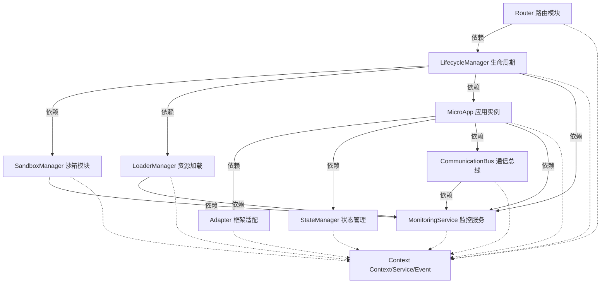
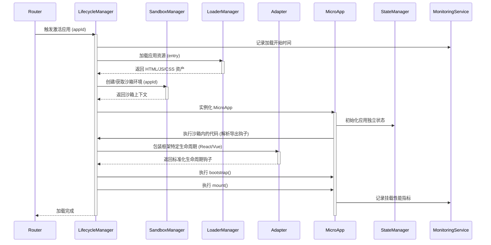
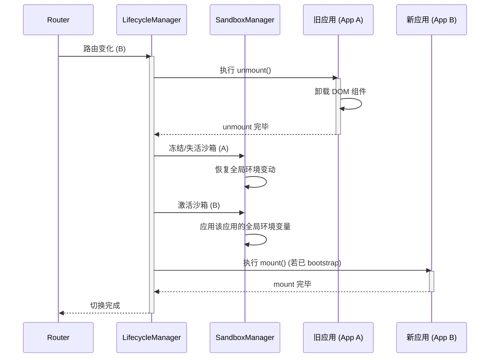
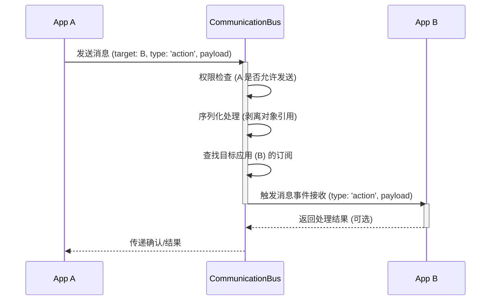
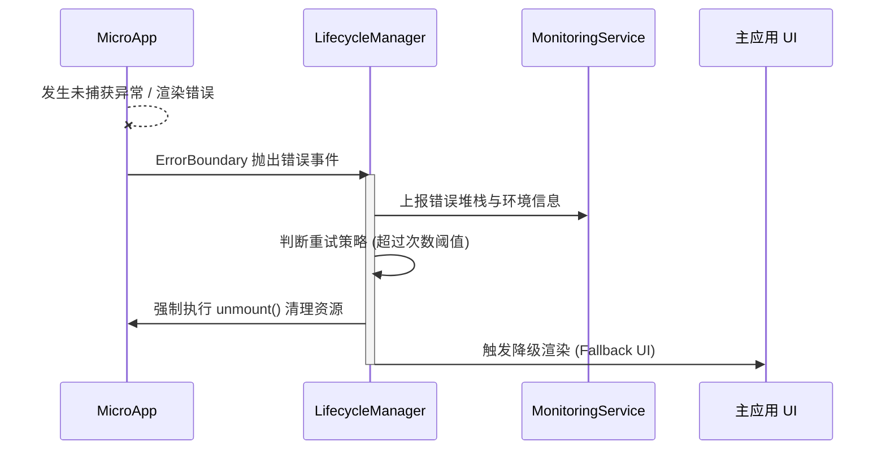
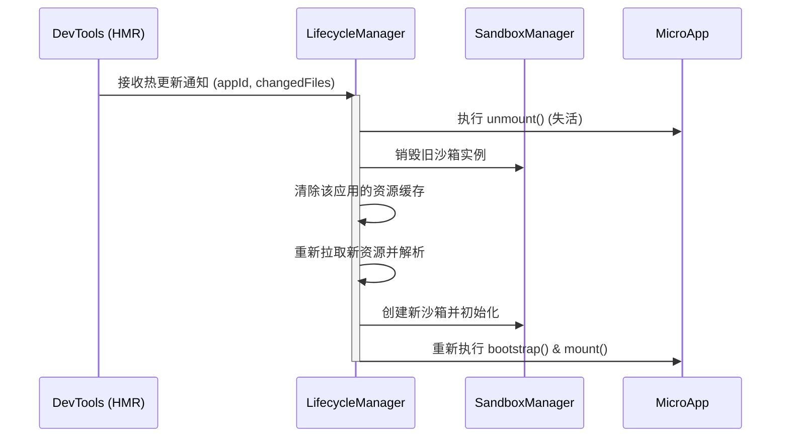

# Taixu 核心模块交互协议

本文档定义了 Taixu 微前端框架中各核心模块之间的依赖关系、交互流程、事件契约以及初始化顺序。

## 1. 模块依赖关系图

Taixu 框架基于 Cordis 构建，各核心模块以插件的形式注册到上下文（Context）中，通过依赖注入（Service）和事件系统（Event）进行解耦交互。



## 2. 核心流程时序图

### 2.1 应用首次加载流程

当路由匹配到未加载的子应用时，触发首次加载流程。



### 2.2 应用切换流程

从一个子应用切换到另一个子应用的过程，包含旧应用的卸载与新应用的加载。



### 2.3 应用间通信流程

应用 A 向应用 B 发送消息时的拦截与路由机制。



### 2.4 错误恢复流程

应用运行期间发生异常时的隔离与降级处理。



### 2.5 热更新流程 (Dev)

开发模式下文件变动触发的热重载。



## 3. 模块间事件契约

Taixu 使用 Cordis 统一事件总线，事件名称采用命名空间格式以避免冲突。

### 核心事件类型定义 (TypeScript)

    // 路由与多槽位事件
    'router:change': (from: string, to: string, options?: { outlet?: string, signal?: AbortSignal }) => void;
    'router:matched': (appId: string, path: string, outlet?: string) => void;
    'router:aborted': (path: string, reason: string) => void;

    // 生命周期事件 (依托 Cordis Fork / Plugin)
    'lifecycle:beforeLoad': (appId: string, signal?: AbortSignal) => void;
    'lifecycle:loaded': (appId: string) => void;
    'lifecycle:beforeMount': (appId: string, container: HTMLElement) => void;
    'lifecycle:mounted': (appId: string) => void;
    'lifecycle:beforeUnmount': (appId: string) => void;
    'lifecycle:unmounted': (appId: string) => void;
    'lifecycle:error': (appId: string, error: Error) => void;

    // 沙箱与 DOM 隔离事件
    'sandbox:created': (appId: string, sandboxCtx: any) => void;
    'sandbox:destroyed': (appId: string) => void;
    'sandbox:activated': (appId: string) => void;
    'sandbox:deactivated': (appId: string) => void;

    // 通信与状态 (支持 Sticky 粘性消息与 Deep Reactive State)
    'comm:message': (sender: string, receiver: string, payload: any, metadata?: { sticky?: boolean, traceId?: string }) => void;
    'state:change': (appId: string, key: string, value: any, oldValue: any, path?: string) => void;

    // 监控与全链路追踪事件 (W3C TraceContext)
    'monitor:report': (metric: MetricPayload, traceId?: string) => void;
    'monitor:error': (errorPayload: ErrorPayload, traceId?: string) => void;
}
```

任何插件均可通过 `ctx.on` 订阅这些事件：

```typescript
ctx.on('lifecycle:mounted', (appId) => {
    ctx.logger.info(`应用 ${appId} 已挂载完成`);
});
```

## 4. 模块初始化顺序

由于模块之间存在依赖，Taixu 在 Cordis Context 中的初始化顺序需满足以下规则：

1. **基础能力层**
   - **MonitoringService**: 最先初始化，以便记录其他模块初始化过程中的性能与异常。
   - **CommunicationBus**: 初始化跨应用通信基座。
   - **StateManager**: 初始化全局状态容器。

2. **核心机制层**
   - **SandboxManager**: 准备沙箱生成器。
   - **LoaderManager**: 准备资源加载器和缓存机制。
   - **Adapter**: 准备前端框架适配器。

3. **调度层**
   - **LifecycleManager**: 依赖沙箱、加载器和适配器，负责子应用的创建和流转调度。

4. **路由层**
   - **Router**: 依赖生命周期管理器，接管浏览器 History，根据 URL 触发 LifecycleManager 的动作。作为启动流程的最后一步，初始化完毕后会执行首次路由匹配。

## 5. 错误传播路径

1. **子应用代码错误 (运行时)** -> 触发沙箱的 `window.onerror/onunhandledrejection` 拦截 -> 发送给 SandboxManager -> 通过 `ctx.emit('monitor:error')` 上报。
2. **生命周期错误 (加载/解析/挂载)** -> 生命周期 Promise 捕获 -> LifecycleManager 派发 `lifecycle:error` -> 执行重试或 Fallback 渲染 -> MonitoringService 收集。
3. **资源加载失败** -> LoaderManager 捕获网络异常 -> 抛出至 LifecycleManager -> 进行错误降级处理。

所有的错误都汇聚到 Cordis 的全局错误处理和 `MonitoringService` 中。

## 6. 统一事件系统设计

传统微前端框架往往会各自维护一套 EventBus 机制。在 Taixu 中，由于基于 **Cordis** 构建，所有的核心模块以及每个子应用的上下文（可通过 `ctx.isolate()` 隔离生成）都共享底层统一架构。

### 无缝的事件注册与清理

所有模块**必须**使用 `ctx.on()` 与 `ctx.emit()` 进行事件通信，抛弃独立的 EventEmitter 实例。

```typescript
// 错误示例：独立 EventBus
const bus = new EventEmitter();
bus.on('xxx', handler); 
// 卸载时容易忘记 removeListener 导致内存泄漏

// Taixu 推荐规范
export function apply(ctx: Context) {
    // 注册监听器
    ctx.on('router:change', (from, to) => {
        // do something
    });

    // 触发事件
    ctx.emit('monitor:report', { type: 'route_time', value: 120 });
}
```

### 自动垃圾回收机制

依赖于 Cordis 的 Fiber 和 Effect 管理机制，当一个插件（或者一个被包装为插件形式运行的子应用）被注销 / 失活时：

1. 子应用的卸载对应着调用其对应 Context / Fork 的 `dispose()` 方法。
2. **所有在这个 Context 上通过 `ctx.on` 绑定的事件监听器会自动被清理**。
3. 所有在这个 Context 内通过 `ctx.effect` 注册的副作用会自动反向执行撤销。

这种设计确保了极其纯净的沙箱隔离特性，从架构底层根除了微前端场景中常见的内存泄漏与事件幽灵订阅问题。
